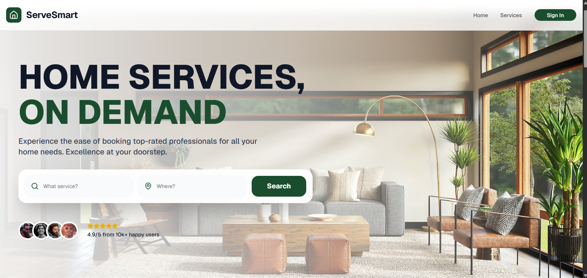
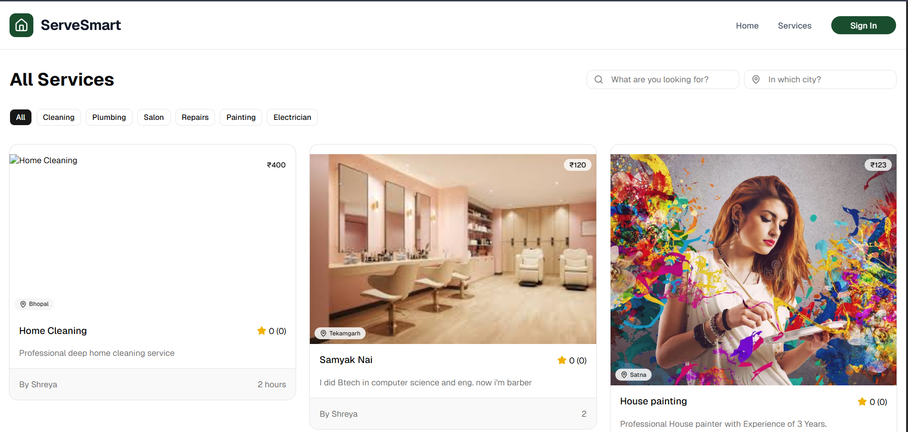
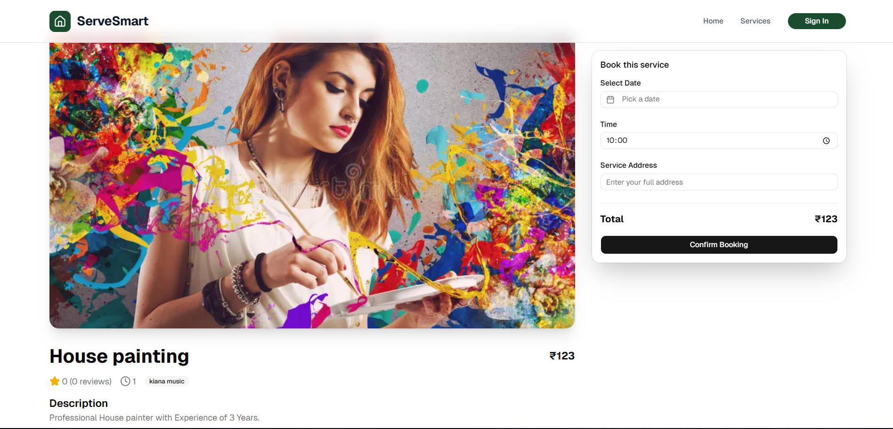
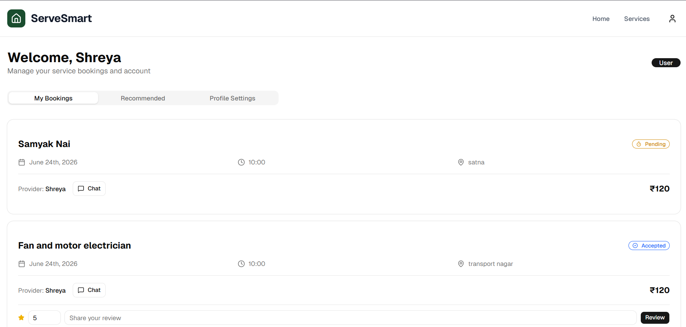
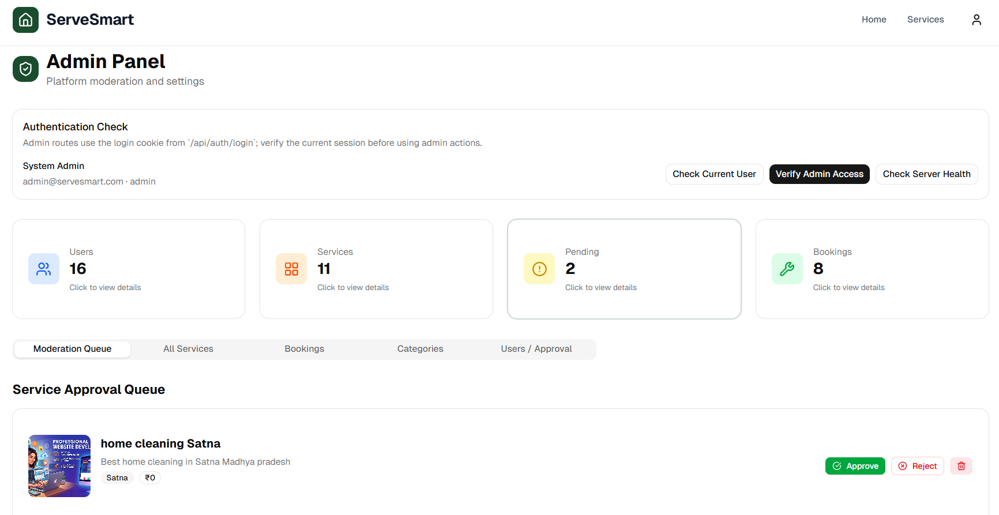

# 🏠 ServSmart - On-Demand Home Service Platform

ServSmart is a full-stack MERN-based web application that connects customers with trusted home service providers. The platform allows users to discover services, book appointments, make online payments, and track bookings, while providers can manage their services and bookings through a dedicated dashboard.

---

## 🚀 Features

### 👤 User Features

* User Registration & Login
* JWT Authentication
* Browse Services by Category
* AI recommended Services
* Search and Filter Services
* View Service Details
* Book Home Services
* Booking History Tracking
* Stripe Payment Integration
* Email Notifications

### 🛠️ Provider Features

* Provider Registration
* Create and Manage Services
* Update Service Information
* View Booking Requests
* Accept or Reject Bookings
* Provider Dashboard
* Booking Status Management

### 👨‍💼 Admin Features

* Approve/Reject Providers
* Approve/Reject Services
* Manage Categories
* Monitor Platform Activities
* Dashboard Analytics

---

## 🏗️ System Architecture

Frontend (React.js + Vite)
↓
REST APIs
↓
Backend (Node.js + Express.js)
↓
MongoDB Database
↓
Cloudinary (Image Storage)
↓
Stripe (Payment Gateway)
↓
Nodemailer (Email Notifications)

---

## 💻 Tech Stack

### Frontend

* React.js
* TypeScript
* Vite
* Tailwind CSS
* React Router DOM
* Axios

### Backend

* Node.js
* Express.js
* TypeScript
* JWT Authentication
* Nodemailer

### Database

* MongoDB
* Mongoose

### Third-Party Services

* Cloudinary
* Stripe
* Google Gemini

### Tools

* Postman
* Git & GitHub

---

### AI recommendation working

* Only Login User can view recommended-services by AI
* If the user has bookings, it recommends other approved services from the same booked categories.
* It excludes services already booked by that user.
* If there are not enough category matches, it fills with top-rated approved services.
* If the user has no bookings, it shows top-rated approved services.

## 📂 Project Structure

```bash
ServSmart/
│
├── frontend/
│   ├── src/
│   ├── public/
│   ├── components/
│   └── package.json
│
├── Backend/
│   ├── controllers/
│   ├── middleware/
│   ├── models/
│   ├── routes/
│   ├── services/
│   ├── server.ts
│   └── package.json
│
└── README.md
```

---

## ⚙️ Installation

### Clone Repository

```bash
git clone https://github.com/yourusername/servsmart.git
cd servsmart
```

### Install Frontend and backend

```bash

npm install
npm run dev
```


---

## 🔑 Environment Variables

Create a `.env` file inside the server directory.

```env
PORT=3000

MONGO_URI=your_mongodb_connection_string

JWT_SECRET=your_jwt_secret

STRIPE_SECRET_KEY=your_stripe_secret_key
STRIPE_WEBHOOK_SECRET=your_webhook_secret

EMAIL_USER=your_email
EMAIL_PASS=your_email_password

CLOUDINARY_CLOUD_NAME=your_cloud_name
CLOUDINARY_API_KEY=your_api_key
CLOUDINARY_API_SECRET=your_api_secret

APP_URL=http://localhost:5173
```

---

## 📌 Core Modules

### Authentication Module

* User Registration
* Login
* Role-Based Access Control

### Service Management Module

* Create Service
* Update Service
* Delete Service
* Service Approval Workflow

### Booking Management Module

* Create Booking
* Accept/Reject Booking
* Booking Tracking
* Slot Validation

### Payment Module

* Stripe Checkout Session
* Webhook Verification
* Payment Status Tracking

### Dashboard Module

* User Dashboard
* Provider Dashboard
* Admin Dashboard

---

## 🔒 Security Features

* JWT Authentication
* Password Hashing using bcrypt
* Role-Based Authorization
* Protected API Routes
* Input Validation
* Secure Payment Processing

---

## Advance Features

* AI-Based Service Recommendations
* Real-Time Chat System
* Ratings & Reviews

---


## 🎯 Objectives

* Simplify home service booking.
* Connect customers with verified service providers.
* Generate employment opportunities for local service professionals.
* Provide secure online booking and payment facilities.
* Improve transparency and service accessibility.

---

## 📈 Future Enhancements


* Mobile Application (Android & iOS)
* Live Provider Tracking
* Advanced Analytics Dashboard
* Multi-Language Support

---


**Project Title:** ServSmart – On-Demand Home Service Platform

## 📸 Screenshots

### Home Page


### Service Page



## Dashboard




